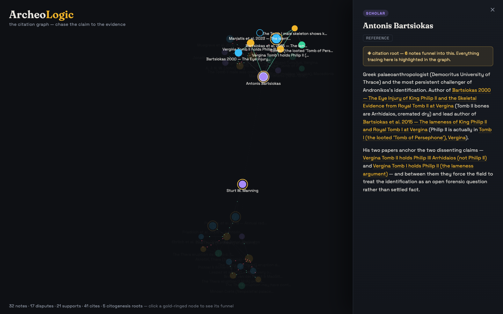
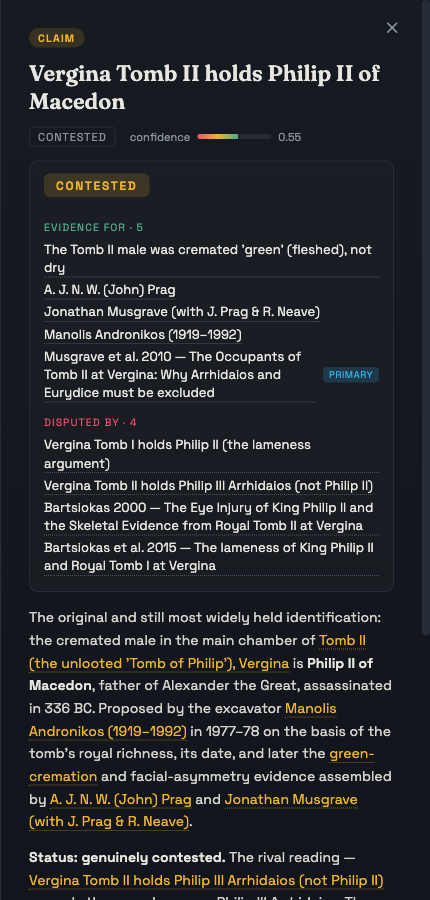
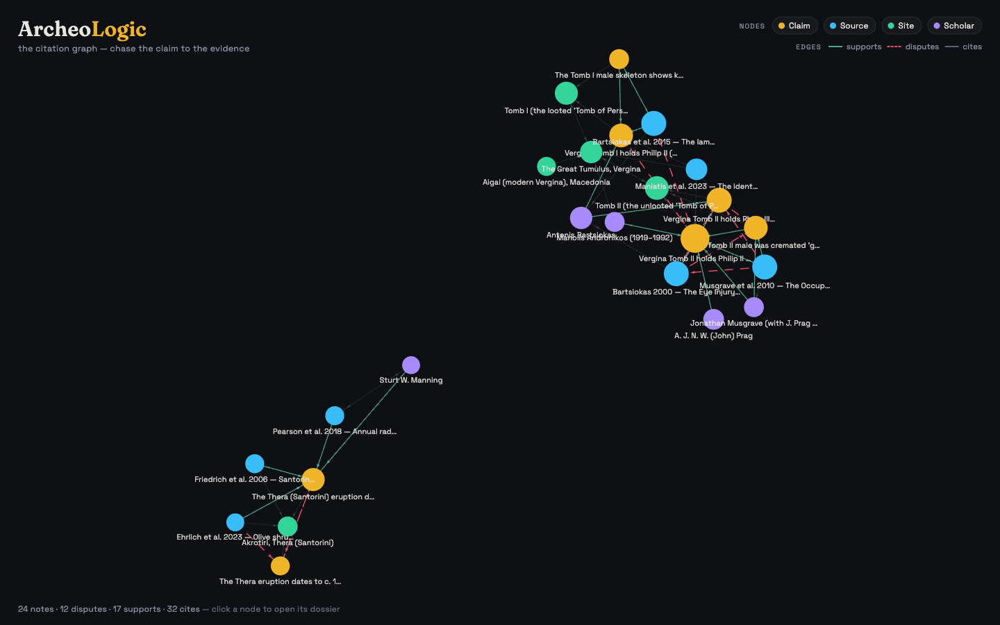
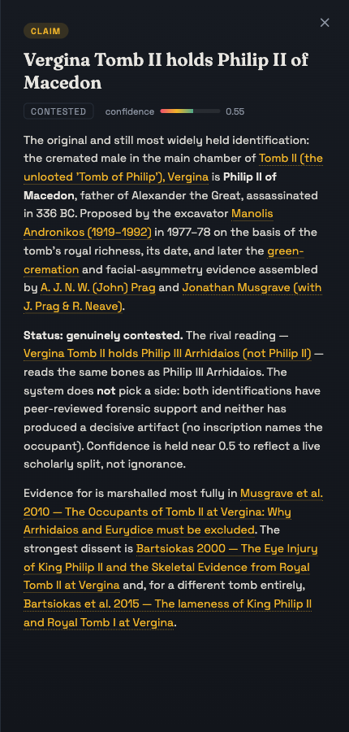

# ArcheoLogic 🏺

**The AI archaeologist.** An LLM agent that investigates historical and
archaeological claims the way a scholar does — chasing citations back to primary
evidence, building a living knowledge base as it digs, and returning **cited
verdicts** with confidence levels and honest dissent.

> 99% of archaeology is done in the library. This is the librarian that never
> sleeps — and never repeats a claim without checking where it came from.

## What it does

Give it a claim — *"the Thera eruption destroyed Minoan civilization"*,
*"Vergina Tomb II belongs to Philip II of Macedon"* — and it:

1. **Investigates at scale** — searches open scholarly sources, excavation
   reports, gazetteers; follows citations from paper to paper.
2. **Traces claims to their roots** — separates primary evidence (excavation
   reports, radiocarbon dates) from echo (textbooks citing textbooks). Detects
   **citogenesis**: "everyone knows X" that traces to a single 1930s paper.
3. **Writes a living wiki** — one markdown note per claim / source / site /
   scholar, interlinked with `[[wikilinks]]` (Karpathy LLM-wiki style). The wiki
   *is* the knowledge graph, git-versioned, growing with every investigation.
4. **Renders the graph on the web** — an interactive force-directed graph
   (Obsidian-style): claims amber, sources cyan, sites green, scholars violet;
   *supports* solid, *disputes* red. Click a node → read the dossier.
   Citation circularity becomes a **visible shape**.
5. **Returns a cited verdict** — verdict + confidence, the evidence chain, the
   dissenting minority and why, every statement linked to its source.
6. **Scores itself honestly** — evaluated against a golden set of claims with
   known scholarly status (settled-true / settled-false / genuinely contested).

**Beachhead domain:** Greek archaeology (Thera, Vergina, Mycenae) — home
advantage in language and sources.

## Status

🚧 Private while under construction. **Steps 1–5 of 6 are in place** — the wiki →
graph → interactive UI pipeline (step 1, hand-authored seed), the investigation
agent that extends it (step 2, including model-in-the-loop runs through the
anti-hallucination gate — now three domains: Vergina, Thera, Mycenae), mechanical
citation-chasing + citogenesis detection (step 3), a verdict dossier (step 4), and
an evaluation layer that scores verdicts against a golden set (step 5, see
[EVALUATION.md](EVALUATION.md)). Only publishing (step 6) remains.

## What's built so far (step 1: de-risk the demo)

The whole visual pipeline, working locally with **zero LLM risk** — 24 hand-written,
source-verified notes across two independent claim clusters:

- **Vergina** (15 notes) — the genuinely contested question of *who lies in Tomb II*:
  Philip II (Andronikos) vs. Philip III Arrhidaios (Bartsiokas), plus the Tomb I
  lameness argument. Green-vs-dry cremation forensics, the excavator, the skeptics.
- **Thera / Santorini** (9 notes) — the *high vs. low chronology* eruption-dating
  debate: radiocarbon (~1600 BCE) vs. archaeological synchronism (~1500 BCE).

Every **source** node is backed by a real, fetched document (Bartsiokas 2000 in
*Science*, Musgrave et al. 2010, Bartsiokas et al. 2015 in *PNAS*, Friedrich et al.
2006, Pearson et al. 2018, Ehrlich et al. 2023) — the project's cardinal rule
(*no source node without a fetched document*) applied even to the hand-written seed.

### Step 2 in action — the agent grows the corpus

The [investigation agent](agent/README.md) has since added a third cluster
(8 notes) by investigating a *new* claim — **"the Thera eruption destroyed Minoan
civilization"** — through the same tools and the same gate. It found the popular
claim **refuted** (confidence 0.20): the eruption falls in Late Minoan IA but the
Cretan palace destructions are Late Minoan IB, 30–150 years later, and it traced
the thesis to a single citogenesis root (Marinatos 1939). Every source it cites
(Pichler & Schiering 1977, Bruins et al. 2009, Lespez et al. 2021) is a document
it fetched through the gate. Those notes are byte-identical in format to the
hand-authored ones — same parser, same graph — so the corpus is now 32 notes.

### Step 3 — citation-chasing & citogenesis detection

The parser now analyzes the citation structure **mechanically** (`tools/build_graph.py`):
it tiers sources **primary vs. secondary** (a review/echo is drawn hollow) and
finds citation **roots** — evidence that many claims *transitively funnel into*.
In the UI, click a gold-ringed root and its whole **funnel lights up** while the
rest of the graph recedes, so citation circularity becomes a visible shape — the
thing a human reviewer would otherwise have to trace by hand (as the step-2 agent
did in prose for Marinatos 1939).

The current corpus surfaces **5 roots** — e.g. the scholar *Antonis Bartsiokas*
(6 notes funnel in — he anchors the entire Vergina dissent) and *Friedrich et al.
2006*, the single buried olive branch that much of the Thera high chronology rests
on. Below: focusing Bartsiokas lights his funnel and dims everything else.



### Step 4 — the verdict dossier

Selecting a claim now assembles a **verdict** straight from the graph: the verdict
label + calibrated confidence, the **evidence for** it (each supporting source
tagged primary or echo), and everything that **disputes** it — every line
clickable, so you can walk the argument. It's the "cited verdict dossier" the
project is ultimately for, rendered from the same edges the graph draws.



### Step 5 — the evaluation layer (the signature)

A golden set (`eval/golden_set.json`) pairs claims with their **known scholarly
status** in three buckets — settled-true, settled-false, and **genuinely
contested** — and `tools/evaluate.py` scores the corpus on:

- **verdict accuracy** — does the note land in the right bucket? A system that
  *resolves* a contested claim scores wrong even if it picks the popular side;
  calling contested claims contested is the whole point.
- **calibration** — is the confidence inside the bucket's band?
- **citation validity** — is every source a claim rests on grounded in a fetched
  document?

Current scores are 100% across the 12-claim seed — and, importantly, the harness
**discriminates**: flipping one verdict to the wrong bucket drops accuracy to 92%
and names the miss. [EVALUATION.md](EVALUATION.md) carries the full table and, in
the o-ilios tradition, an honest account of what this does *not* yet test (it's a
consistency/regression harness until it scores fresh, unattended agent runs; and
citation validity is a grounding proxy, not yet an LLM-judged "does the source
actually say that").



Click any node to open its **dossier** — the rendered note, its confidence, and
its wikilinks (which navigate the graph):



Note how the claim reads *"the system does not pick a side"* and holds confidence
near 0.5 — the epistemic-rigor thesis, made visible: contested claims stay
contested.

## Repository layout

```
wiki/                 the knowledge base — one markdown note per claim/source/site/scholar
                      (YAML frontmatter + typed edges + [[wikilinks]]). Source of truth.
tools/build_graph.py  parser: wiki/*.md → web/public/graph.json (validates, no deps)
web/                  Vite + React + react-force-graph-2d graph UI + dossier panel
docs/img/             screenshots
```

## Run it locally

```bash
python3 tools/build_graph.py     # wiki → web/public/graph.json
cd web && npm install && npm run dev   # open the printed localhost URL
```

The graph is fully static — no API key needed to view it. (Growing the corpus
with the investigation agent is what will use the Claude API; viewing it is free.)

## Publishing (step 6)

`.github/workflows/deploy-pages.yml` builds the graph + web app and publishes it
to **GitHub Pages**. It's **manual-trigger only** — publishing is public and
deliberate, so it never deploys on a push by itself. One-time setup:

1. Pages from a **private** repo needs a paid plan (**GitHub Pro** suffices; on the
   free plan the repo must be public). The published *site* is public either way —
   independent of repo visibility — so the demo can go live while the code stays
   private.
2. Repo → **Settings → Pages → Source: GitHub Actions**, then run the workflow.

Note: the published site bakes the full wiki into `graph.json`, so deploying makes
the **note content** public even if the repository stays private.

## Stack (planned)

- **Agent:** Claude API (agentic investigation loop, tool use)
- **Knowledge base:** Markdown wiki + `[[wikilinks]]` → parsed to graph JSON
- **Retrieval:** embeddings + pgvector
- **Graph UI:** React + react-force-graph (WebGL), static build → GitHub Pages
- **Data:** Open Context, ADS, Pleiades, Zenodo, open-access journals

---

*Built by [Dimitris Kogias](https://captainjimbo.github.io) — physicist & AI/ML
systems engineer. Sibling project: [Ο Ήλιος — The Living Sun](https://github.com/CaptainJimbo/o-ilios).*
